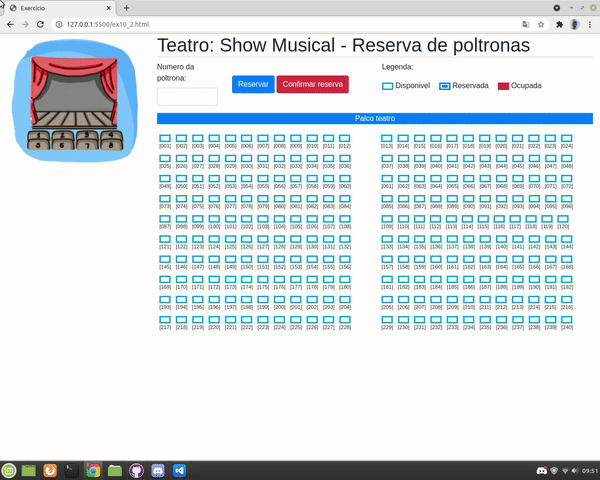

<h1 align="center"> seat control </h1>
 
 
 
 
 
 
 

 
 
 > status: Concluded ✔️
 
 
 
 ## How to use this algorithm?

1. select place
     + Choose the available location to save your location, just see the seat number and type in the input above
2. confirm seat
     + By clicking "Confirm" you will keep your seat permanently

## What does this algorithm consist of?

This program was made for places with large audiences such as theaters, cinemas and even operas. It will help the customer save their seat for the show.

## Technologies used

<table> 
 <tr>
  <td>JavaScript</td>
  <td>HTML</td>
  <td>CSS</td>
  <td>Bootstrap</td>
 </tr>
 <tr> 
  <td> ECMAS v8.0</td>
  <td> v5.0 </td>
  <td>v3.0</td>
  <td>v4.0.0</td>
 </tr>
</table>

## License
Repository covered by [MIT](http://escolhaumalicenca.com.br/licencas/mit/) license
